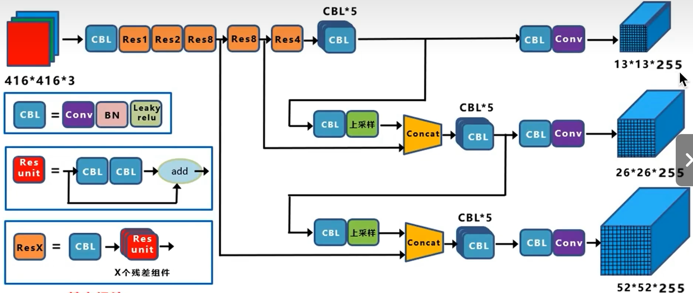
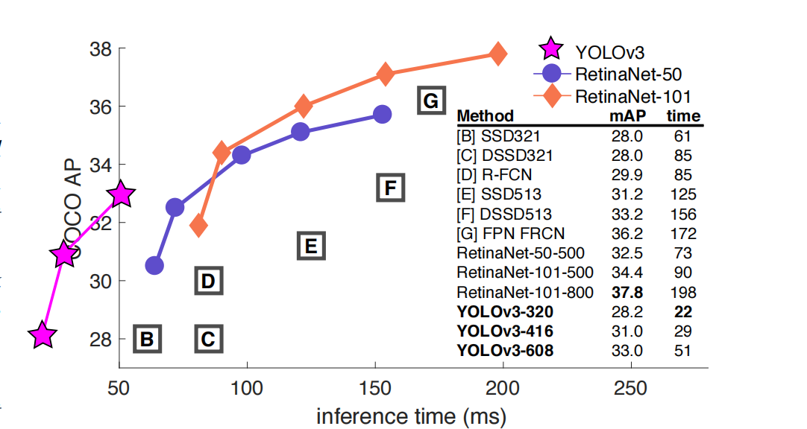

## YOLOV3笔记：
yolov3是作者在yolo的基础上进行更新后的模型，新网络尽管比之前的规模较大，但精度更高，且速度更快，比起其他网络性能也更优异。

## 1. deal：
**bounding box 预测：**yolov3沿用了yolo9000中的锚盒，损失函数使用的平方和损失，并使用逻辑回归预测先验边界框的得分，用nms预测超越阈值但非最大的先验预测框，与yolov2的区别在于每一个ground truth只分配一个先验预测框。
**类别预测：**不使用softmax，而是用多个独立的逻辑斯谛分类器，以及二分类交叉熵损失函数，预测框由预设的三种anchor进行偏移和缩放得到，同时需要以grid cell的下采样倍数得到原始输入图像上预测框的X,Y坐标，再与GT进行拟合。应由与GT的Iou最大的anchor负责拟合该GT且置信度标签值为1，不再将Iou直接作为置信度得分。Iou没有到达阈值的anchor作为负样本，只有正样本对分类和定位学习产生贡献，负样本只对置信度学习产生贡献。

### 1.2
每个预测框的的每个类别逐一用逻辑回归输出概率，可由多个类别输出高概率。
### 1.3
Yolov3在三个尺度上，输出三个尺度的feature map，网络最后预测了3维编码的预测框，分别提取浅层细粒度像素结构信息和深层抽象特化语义信息，用于检测图像中不同大小的物体。

### 1.4
骨干网络用的是Darknet-53，分别通过8倍，16倍，32倍下采样多尺度提取特征，该网络性能较其他网络更优异，网络结构如下图所示：

### 1.5
端到端训练，不利用难以挖掘的特征，还用到了数据增强和batch normalization等stuff。
### 2 性能评估
Yolov3在map@0.5的得分较高，但在map@0.5：0.95的得分一般，精准定位性能仍然较差。
### 3 尝试了但效果不佳的trick
**Focal loss：**解决单阶段目标检测正负样本不均衡、有效负样本少的问题，yolov3中负样本IOU阈值设置过高，导致负样本中混入了疑似正样本label noise，而focalloss又会给noise赋予更大权重，因此效果不好。
**双Iou阈值：**单阶段目标检测不缺正样本，缺高质量负样本。