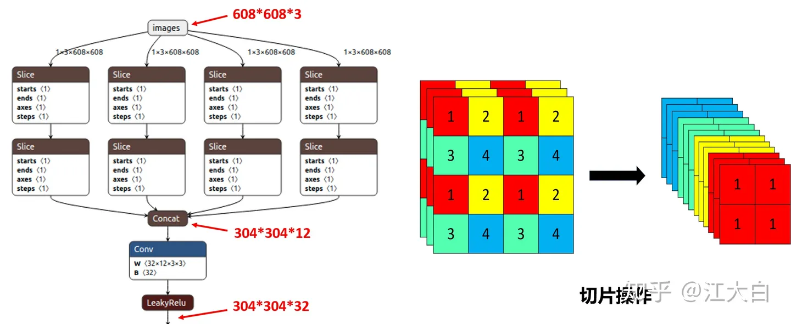
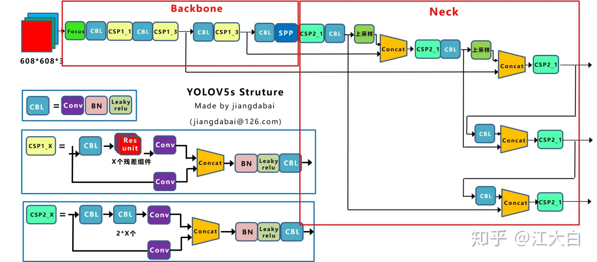

## YOLOv5笔记

YOLOv5在YOLOv4算法的基础上做了进一步的改进，检测性能得到进一步的提升.
输入端采用了和Yolov4一样的Mosaic数据增强的方式。
Mosaic数据增强提出的作者也是来自Yolov5团队的成员，不过，随机缩放、随机裁剪、随机排布的方式进行拼接，对于小目标的检测效果还是很不错的。

**自适应锚框计算：**在Yolov3、Yolov4中，训练不同的数据集时，计算初始锚框的值是通过单独的程序运行的。
但Yolov5中将此功能嵌入到代码中，每次训练时，自适应的计算不同训练集中的最佳锚框值。

**自适应图片缩放：**yolov5代码中对此进行了改进，也是Yolov5推理速度能够很快的原因。作者认为，在项目实际使用时，很多图片的长宽比不同，因此缩放填充后，两端的黑边大小都不同，而如果填充的比较多，则存在信息冗余，影响推理速度。因此在Yolov5的代码中datasets.py的letterbox函数中进行了修改，对原始图像自适应的添加最少的黑边，在推理时，计算量也会减少，即目标检测速度会得到提升。

作者提出了**focus网络结构**，其中比较关键是切片操作。

**网络结构**主要由以下几部分组成：
Backbone: New CSP-Darknet53
Neck: SPPF, New CSP-PAN
Head: YOLOv3 Head
与YOLOv4对比，YOLOv5在Backbone部分无太大变化
Neck网络中将SPP换成成了SPPF，将输入并行通过多个不同大小的MaxPool，然后做进一步融合，很大程度上解决目标多尺度问题。
Yolov5中还设计了两种CSP结构，以Yolov5s网络为例，CSP1_X结构应用于Backbone主干网络，另一种CSP2_X结构则应用于Neck中，就是New CSP-PAN了，在YOLOv4中，Neck的PAN结构是没有引入CSP结构的，但在YOLOv5中作者在PAN结构中加入了CSP

Yolov5中采用的CIOU_Loss做Bounding box的损失函数，并采用nms非极大值抑制筛选目标框。
